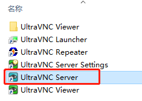

# 准备工作

git、node安装省略...

UltraVNC VNC server 下载地址

[https://uvnc.com/](https://uvnc.com/)

noVNC项目 git地址

[https://github.com/novnc/noVNC](https://github.com/novnc/noVNC)

noVNC所需WebSocket项目 git地址

[https://github.com/novnc/websockify-js](https://github.com/novnc/websockify-js)

# 安装UltraVNC

安装VNC服务，next......


安装完成运行VNC server，右键右下角，可设置密码、端口等。。。




# 克隆项目

noVNC 和 websockify-js项目克隆完成后，进入websockify-js项目中的websockify目录安装依赖。修改websockify.js 中 filename拼接访问的html。


# 运行

说明见上图（完整功能需要指定 pem及key）

```bash
node websockify.js --web ../../noVNC-1.4.0/ 9000 localhost:5900
```

# 访问

输入VNC服务设置的密码进入


