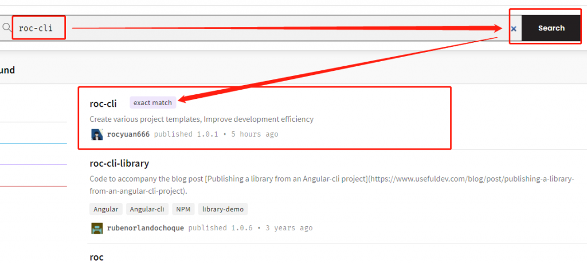

## roc-cli介绍

roc-cli是一款创建多种项目脚手架，平时开发项目用vue或react等脚手架创建的项目，都需要手动删除一堆垃圾代码并且配置非常多的常用库以及对他们的封装，非常麻烦，roc-cli会帮你创建没有垃圾代码并且有常用的库的配置以及封装好的项目模板，提高开发效率；目前支持vue2.x、react、uni-app模板项目，后续会完善项目模板，并增加微信小程序、vue3.x等项目模板。

## npm官方仓库

仓库地址：

[https://www.npmjs.com/package/roc-cli](https://www.npmjs.com/package/roc-cli)

## roc-cli安装

全局安装： ` npm i -g roc-cli `

## 使用说明

使用非常简单，全局下安装了roc-cli后就可以在命令行使用roc命令（使用后上下选择创建的项目）。

` roc create projectName `
