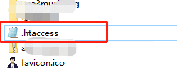

网站根目录创建 .htaccess文件

添加以下内容：
```css
会影响子域名（复制时候去掉本行）：
RewriteEngine on
RewriteBase /
RewriteCond %{SERVER_PORT} !^443$
RewriteRule ^.*$ https://%{SERVER_NAME}%{REQUEST_URI} [L,R]


不会影响子域名，只有主域名重定向（复制时候去掉本行）：
RewriteEngine On
RewriteBase /
RewriteCond %{SERVER_PORT} !^443$
RewriteCond %{HTTP_HOST} !^www.luojing.top
RewriteRule ^.*$ https://%{SERVER_NAME}%{REQUEST_URI} [L,R]


排除某个子域名（复制时候去掉本行）：
RewriteEngine On
RewriteBase /
RewriteCond %{SERVER_PORT} !^443$
RewriteCond %{REQUEST_URI} !^http://roc.luojing.top
RewriteRule ^.*$ https://%{SERVER_NAME}%{REQUEST_URI} [L,R]
```
