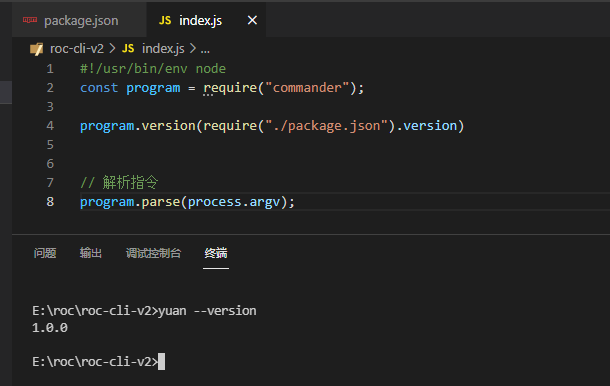
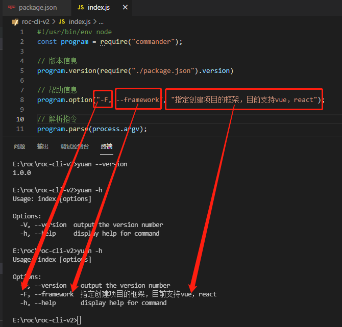
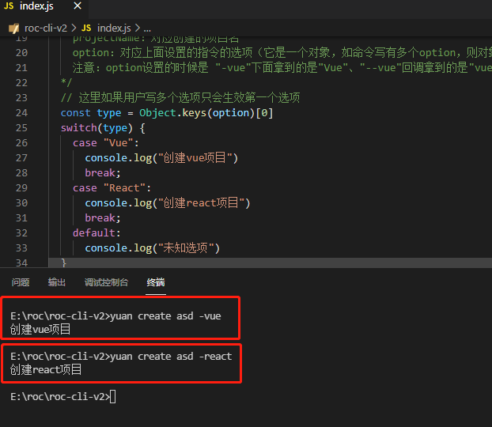
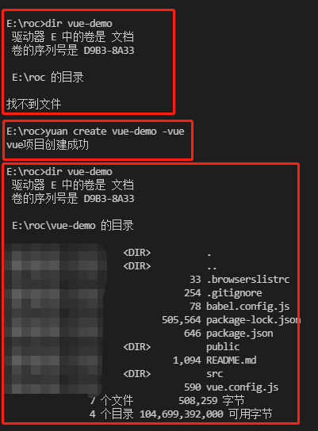

## 前言

vue-cli、create-react-app、angular-cli…已经有了，为什么还要创建自己的脚手架？

个人需求：每次使用官方自带的脚手架创建好项目后，总是要删除一大堆垃圾代码，还要重复性配置封装各种常用的库；而且不同项目得使用不同的脚手架工具（这个还可以接受，主要是前者）。

以下只是提供了简易的创建过程，为了理清思路，通俗易懂，全写在一个js文件中；一般会进行封装，模块化管理。

## 思路

使用cli命令行生成项目模板，模板从哪来？其实模板我们可以在github、gitee或自行搭建的git上进行拉取；只不过我们使用cli时候后面跟上项目类型则会拉取不同的git地址。比如我的[roc-cli](https://www.npmjs.com/package/roc-cli)的使用。

## 初始化项目

首先使用npm初始化一个项目npm init -y，会在项目根目录生成package.json文件

```json
{
  "name": "roc-cli-v2",
  "version": "1.0.0",
  "description": "",
  "main": "index.js",
  "scripts": {
    "test": "echo \"Error: no test specified\" && exit 1"
  },
  "keywords": [],
  "author": "",
  "license": "ISC",
+  "dependencies": {
+    "commander": "^7.2.0",
+    "download-git-repo": "^3.0.2"
+  }
}
```

## 依赖项

我们需要依赖两个工具commander、download-git-repo

安装：`npm i commander download-git-repo`。

commander：node.js命令行工具，它可以让我们的脚手架运行在命令行。

npm：[https://www.npmjs.com/package/commander](https://www.npmjs.com/package/commander)

github：[https://github.com/tj/commander.js](https://github.com/tj/commander.js)

download-git-repo：从节点下载并提取git存储库（GitHub、GitLab、Bitbucket）。虽然官方提到的只有这三个平台，亲测gitee（码云）或自行搭建的git平台也是可以的。

npm：[https://www.npmjs.com/package/download-git-repo](https://www.npmjs.com/package/download-git-repo)

## 入口文件

### 一、package.json中添加：

```json
"bin": {
  "yuan": "index.js"
},
```

“yuan”则是生效的命令，index.js则是入口文件

### 二、在index.js中的顶部添加：

```bash
#!/usr/bin/env node
```

### 三、测试我们的“yuan”指令

一般我们全局安装某个脚手架时才能在命令行使用脚手架命令，因为此时npm源并没有我们的脚手架所以我们不能安装，但是可以使用npm link来连接到我们的脚手架模块进行测试。
在项目根目录运行：`npm link`

## 运行命令

此时就可以在命令行运行yuan命令，则不会报错“yuan不是内部或外部命令，也不是可运行的程序或批处理文件。”

但是现在运行yuan后并没有反应。

## commander使用

以上github地址中有它的详细用法

### 版本信息

```javascript
const program = require("commander");

// 获取版本但是这么写我们的脚手架每次版本更新都要更改业务代码不合适！！！
// program.version("0.0.1")
// 更改成下面这样，会获取package.json中的版本信息
program.version(require("./package.json").version)

// 解析指令，这点很重要  不解析指令则无效
program.parse(process.argv);
```



### 帮助信息

默认就有帮助信息可运行yuan -h，帮助信息中的“版本”与“帮助”是自带的，我们也可使用option进行自定义。



自定义帮助信息：program.option("-F, --framework", "指定创建项目的框架，目前支持vue，react");

### 创建指令

使用command创建命令，option创建选项，action创建执行后的回调

此时的完整代码：

```javascript
#!/usr/bin/env node
const program = require("commander");

// 版本信息
program.version(require("./package.json").version)

// 帮助信息
program.option("-F, --framework", "指定创建项目的框架，目前支持vue，react");

// 创建指令
program
.command("create <projectName>")
.description("指令描述")
.option("-vue", "选项描述")
.option("-react", "选项描述") // option 可有多个
.action((projectName, option) => {
  /*
    执行指令的回调方法
    projectName：对应创建的项目名
    option：对应上面设置的指令的选项（它是一个对象，如命令写有多个option，则对象中会增加属性，如果写了未定义的option，命令行会报错提示“未知选项”）
    注意：option设置的时候是 "-vue"下面拿到的是"Vue"、"--vue"回调拿到的是"vue"，我为了cli工具使用方便则用了一个"-"的
  */
  // 这里如果用户写多个选项只会生效第一个选项
  const type = Object.keys(option)[0]
  switch(type) {
    case "Vue":
      console.log("创建vue项目")
      break;
    case "React":
      console.log("创建react项目")
      break;
    default:
      console.log("未知选项")
  }
})

// 解析指令
program.parse(process.argv);
```

运行：



指令的问题已经搞定，接下来要做的是不同的命令下载不同的git仓库

## download-git-repo使用

引入后直接使用即可，详细用法参考以上npm官网，东西也比较少

目前代码：

```javascript
#!/usr/bin/env node
const program = require("commander");
const download = require("download-git-repo");

// 版本信息
program.version(require("./package.json").version)

// 帮助信息
program.option("-F, --framework", "指定创建项目的框架，目前支持vue，react");

// 创建指令
program
  .command("create <projectName>")
  .description("指令描述")
  .option("-vue", "选项描述")
  .option("-react", "选项描述") // option 可有多个
  .action((projectName, option) => {
    /*
      执行指令的回调方法
      projectName：对应创建的项目名
      option：对应上面设置的指令的选项（它是一个对象，如命令写有多个option，则对象中会增加属性，如果写了未定义的option，命令行会报错提示“未知选项”）
      注意：option设置的时候是 "-vue"下面拿到的是"Vue"、"--vue"回调拿到的是"vue"，我为了cli工具使用方便则用了一个"-"的
    */
    // 这里如果用户写多个选项只会生效第一个选项
    const type = Object.keys(option)[0]
    switch (type) {
      case "Vue":
        // 仓库地址（地址前必须加"direct:"），仓库clone的文件夹名，是否clone，成功失败的回调
        download(
          "direct:https://gitee.com/rocyuan666/roc-cli-vue-template.git",
          projectName,
          { clone: true },
          err => {
            // 个人分析出的两种错误情况：1 同目录项目名已存在 2 储存库出现问题
            if (err) return console.log("项目已存在或存储库错误！");
            // 创建成功 提示
            console.log("vue项目创建成功")
          }
        )
        break;
      case "React":
        console.log("创建react项目")
        break;
      default:
        console.log("未知选项")
    }
  })

// 解析指令
program.parse(process.argv);
```

我只举例了vue项目，其他项目同理。

## 完成 · 测试环境运行脚手架

在命令行执行yuan create vue-demo -vue，就生成了vue-demo的项目，而项目就来自git仓库，后期完善项目模板就直接完善对应的git仓库。



## 脚手架工具上线至npm

首先得注册npm账号，在命令行登录你的账号` npm login `指令登录，登录完成后，在当前应用的目录下执行` npm publish `将脚手架工具发布到npm官网。
