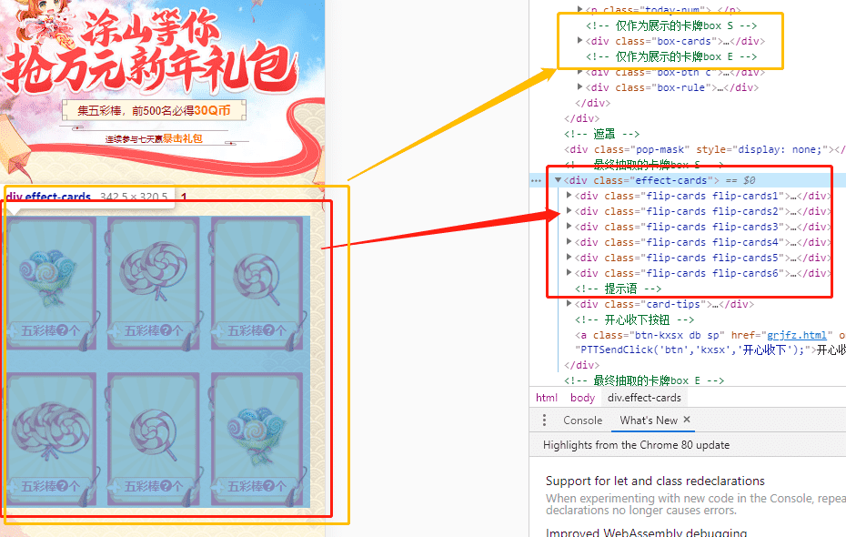
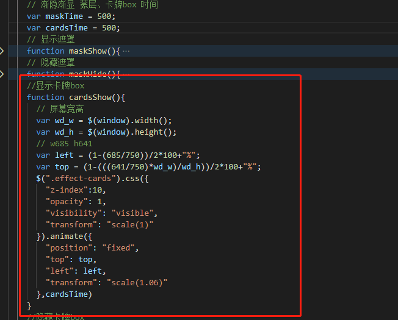

活动过期了，觉得挺有意思的，终于可以拿出来分享了，很遗憾线上也过期了地址没有了，不过我会提供部分线上预览地址（仅供交流学习）并非最终产品；

需求介绍：此需求是腾讯旗下qq元気泡小程序渠道的，狐妖小红娘、火影忍者（两者页面一样，下面以狐妖小红娘为例）游戏2020年新年活动页面，本人负责前端效果开发，具体需求看图（并非最终版本）：

本篇主要交流以上需求效果，付上整张原型图（没办法只能传小点的，主要看上面交互）：

设计师出稿（并非最终版本）：

### 分析需求（只分析抽卡环节）：

- 点击悬浮卡卡牌进入本页面（站外的悬浮卡牌）卡面不展示五彩棒数量。
- 点击参与，进入抽卡环节：
	1. 6张卡片浮起；
	2. 非抽奖区域灰色蒙层覆盖；
	3. 显示五彩棒数量；
	4. 卡片显示两秒后自动聚拢堆叠成一张（看到的一张是第一排左边第一张卡牌）；
	5. 全部翻转至卡牌的背面；
	6. 1秒后卡牌按照轨迹分发开（此时卡牌是背面的，并且加上发光效果）；
	7. 发开后上面人物提示选择一张；
	8. 选中后选中的卡牌发光且只能选择一张 ，其他卡牌光效消失，显示点击收下按钮。

代码主体入口逻辑（将以上逻辑封装成的方法运行起来，）下面展示了各个逻辑实现的方法。

我将 不展示五彩棒数量的模块（页面本身展示的6个卡牌） 与 展示五彩棒数量的模块（抽卡环节的6个卡牌） 分离开了；因为展示在页面的卡牌只是静态的6张卡牌，而抽奖模块的卡牌看似6张实则12张（每张都是正反），两者不同。

**页面中静态卡牌：**

**抽卡环节中的卡牌：**

然后将 抽卡环节的卡牌 定位到 静态展示的卡牌 位置上，只不过 抽卡环节的卡牌 隐藏了起来 ，这样方便制作卡片浮起动画。

布局准备好了后，开始我们的逻辑

准备下需要用到了卡牌数据，及封装卡片数据打乱方法（因为每次打开展示都是随机的）

① 6张卡片显示浮起；

②非抽奖区域灰色蒙层覆盖；

③显示五彩棒数量；（也就是将数据渲染出来）

④ 卡片显示两秒后自动聚拢堆叠成一张（看到的一张是第一排左边第一张卡牌）； 将第一张z-index提高盖住其他5张。

⑤全部翻转至卡牌的背面， 利用了css3动画及翻转

⑥1秒后卡牌按照轨迹分发开（此时卡牌是背面的，并且加上发光效果，主体逻辑中翻转后加上发光了，散发卡片后发光还在）

⑦发开后上面人物提示选择一张。 （由于人物提示图片不止一处且只是图片不同，封装起来了）

⑧选中后选中的卡牌发光且只能选择一张，其他卡牌光效消失，显示点击收下按钮。

