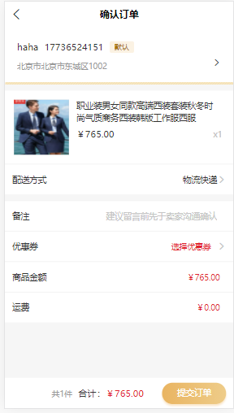
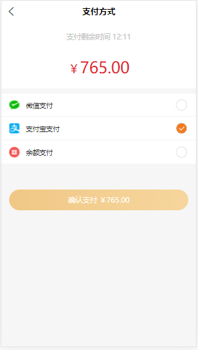

参考：[https://opendocs.alipay.com/open/204/105297](https://opendocs.alipay.com/open/204/105297)

前端点击提交订单发起请求，请求订单信息（后端生成订单信息）；

```javascript
// 创建的订单信息返回参考（示例）
// 为了安全，一般转跳支付页面会使用订单id查询订单数据（客户端不缓存订单数据）
{
	"code": 1,
	"msg": "订单添加成功",
	"time": "1616053430",
	"data": {
		"id": 2211,
		"type": "goods",
		"order_sn": "202103435113298140569200",
		"user_id": 5692,
		"activity_type": "",
		"goods_amount": "765.00",
		"dispatch_amount": "0.00",
		"phone": "17736524151",
		"consignee": "haha",
		"province_name": "北京市",
		"city_name": "北京市",
		"area_name": "东城区",
		"address": "1002",
		"province_id": 110000,
		"city_id": 110100,
		"area_id": 110101,
		"status": 0,
		"memo": null,
		"remark": "",
		"total_amount": "765.00",
		"score_amount": 0,
		"total_fee": "765.00",
		"discount_fee": "0.00",
		"coupon_fee": "0.00",
		"pay_fee": "0.00",
		"score_fee": 0,
		"goods_original_amount": "566.00",
		"coupons_id": 0,
		"transaction_id": null,
		"payment_json": null,
		"pay_type": null,
		"paytime": null,
		"ext": "{\"buy_type\":\"alone\",\"groupon_id\":0,\"expired_time\":1616054331}",
		"platform": "H5",
		"createtime": 1616053431,
		"status_code": "nopay",
		"status_name": "待付款",
		"status_desc": "等待买家付款",
		"btns": ["cancel", "pay"],
		"ext_arr": {
			"buy_type": "alone",
			"groupon_id": 0,
			"expired_time": 1616054331
		}
	}
}
```
跳转支付方式页面，使用订单的order_sn和支付类型（比如支付宝），请求 支付宝订单数据（后端生成支付宝订单数据），然后前端拿支付宝订单数据使用uniapp提供的api（uni.requestPayment）调用支付宝支付；支付完成后返回结果（支付成功与失败）；


```javascript

uni.requestPayment({
  provider: 'alipay', // 支付宝支付
  orderInfo: result.data.pay_data, //支付宝订单数据
  success: function(res) {
    // 跳转结果页面
    Router.replace({
      path: '/pages/order/payment/result',
      query: {
        orderSn: that.order.order_sn,
        type: that.payment,
        pay: 1
      }
    });
  },
  fail: function(err) {
    // 跳转结果页面（失败时可以重新支付的业务）
    // orderSn: that.order.order_sn,
    // type: that.payment,
    console.log('支付取消或者失败:', err);
    if (err.errMsg !== "requestPayment:fail cancel") {
      Router.replace({
        path: '/pages/order/payment/result',
        query: {
          orderSn: that.order.order_sn,
          type: that.payment,
          pay: 0
        }
      });
    }
  }
});
```
